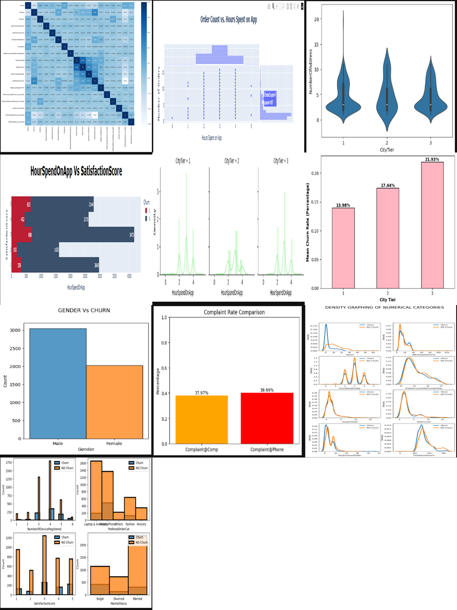

# 🚀 ChurnCast – The Autonomous Retention Intelligence Engine
ChurnCast is a fully automated, production-grade churn prediction system that merges data science, machine learning, and MLOps automation into a single powerful pipeline. It predicts at-risk customers with high precision while ensuring reliability and operational scalability through AWS-powered deployment and CI/CD workflows.

---

## 📸 Project Preview

---

## 🌐 Tech Stack
### **Languages**
- Python 3.10

### **Data Science & ML**
- Scikit-learn  
- TensorFlow / Keras  
- XGBoost  
- Pandas, NumPy  
- Imbalanced-Learn (SMOTEENN)  
- Matplotlib, Seaborn, Plotly  
- Missingno  

### **Backend & API**
- FastAPI  
- Uvicorn  

### **Cloud & Storage**
- MongoDB Atlas  
- AWS S3  
- AWS EC2, AWS ECR  

### **MLOps / DevOps**
- Docker  
- GitHub Actions  
- PyProject / SetupTools  
- Custom Logging & Exception Framework  

### **Frontend**
- HTML / CSS  
- Jinja2  

---

# 📁 Project Structure
